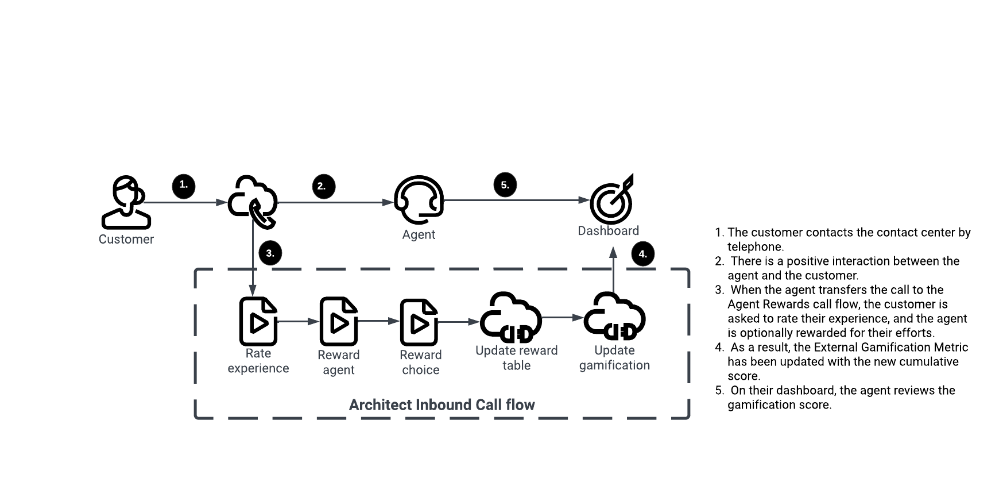

# Build an agent rewards using Genesys Cloud Gamification External Metrics

This Genesys Cloud Developer Blueprint describes how agent rewards can be built using Genesys Cloud Gamification External Metrics. After a customer interacts with an agent, this blueprint surveys them and gives them a reward of their choice if the interaction was positive. This action allows the customer to thank the agent in a tangible way. Customer loyalty is built between the brand and the customer, and talent is rewarded. By using Terraform Genesys Cloud CX as Code provider, all the components involved in this solution can be deployed.

 View the full [Agent Rewards External Metrics Blueprint](https://github.com/GenesysCloudBlueprints/agent-rewards-external-metrics-blueprint "Goes to the Agent Rewards Blueprint") in the Genesys Cloud Developer Center.