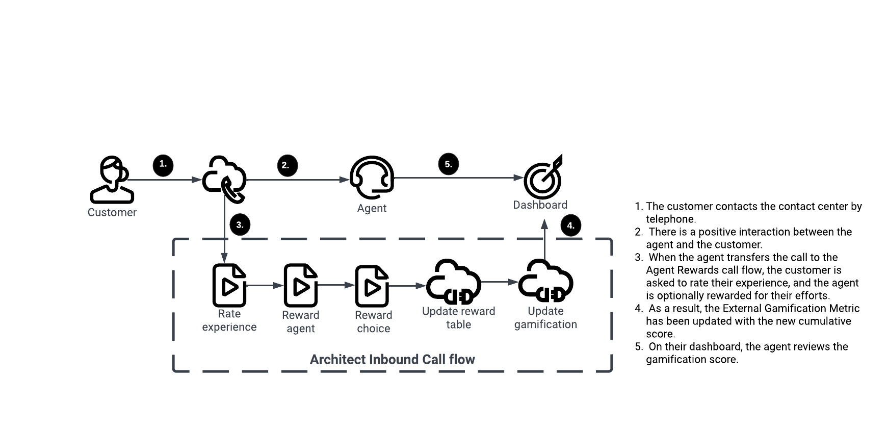

:::{"alert":"primary","title":"About Genesys Cloud Blueprints","autoCollapse":false} 
Genesys Cloud blueprints were built to help you jump-start building an application or integrating with a third-party partner. 
Blueprints are meant to outline how to build and deploy your solutions, not a production-ready turn-key solution.
 
For more details on Genesys Cloud blueprint support and practices, 
see our Genesys Cloud blueprint [FAQ](https://developer.genesys.cloud/blueprints/faq "Opens the Blueprint FAQ") sheet.
:::

Greetings and welcome to the wonderful world of employee rewards. This blueprint offers you the opportunity to learn how Genesys Cloud Gamification External Metrics (GCGEM) can be used together with a simple voice survey to reward your agents based on customer satisfaction.

The blueprint surveys a customer after interaction with an agent. The customer can choose a reward for the agent if their experience was positive.

An agent invokes this experience by using their desktop to transfer the voice interaction to an Architect's Inbound Call flow. This call flow interacts with the customer and updates a Genesys Cloud Data Table that tracks the agent’s cumulative reward score. The reward score appears on the agent’s Scorecard as a Gamification External Metric.

This blueprint contains all the components for creating a simple rewards solution for agents. The rewards presented to customers are converted into a point system for the agent. A busy agent might not appreciate being rewarded with a hundred cups of coffee for various reasons. Therefore, the reader must convert the rewards and associated reward points into actual benefits for the agent.

The following blueprint guides you through configuring your Genesys Cloud organization.



## Scenario

An organization wants its customers to express their appreciation for their service. As a result, customer loyalty is built between the brand and the customer, and talented agents are rewarded.

1. **Ask the customer if their experience with the agent was positive**

2. **Ask the customer if they would like to reward the agent**

3. **Ask the customer to pick a reward for the agent**

## Solution components

* **Genesys Cloud CX** - A suite of Genesys Cloud services for enterprise-grade communications, collaboration, and contact center management. In this solution, you use an Architect inbound message flow, a Genesys Cloud integration, a Genesys Cloud queue, web messaging configuration, and web messaging deployment.
* **Architect flows** - A flow in Architect, a drag and drop web-based design tool, dictates how Genesys Cloud handles inbound or outbound interactions. In this solution, an inbound call flow provides the routing layer that gets the customer to the right queue.
* **Genesys Cloud Gamification External Metrics** - A performance management and Gamification process involves defining performance goals and expectations and measuring performance against these goals. Using this feature, you can integrate external metrics into an employee performance scorecards. It provides supervisors with a comprehensive view of agent performance across all key metrics relevant to your organization.
* **Data Action** - Provides the integration point to invoke a third-party REST web service or AWS lambda.
* **CX as Code** - A Genesys Cloud Terraform provider that provides an interface for declaring core Genesys Cloud objects.

## Prerequisites

### Specialized knowledge

* Administrator-level knowledge of Genesys Cloud
* Experience with Terraform

### Genesys Cloud account

* A Genesys Cloud license. For more information, see [Genesys Cloud Pricing](https://www.genesys.com/pricing "Opens the Genesys Cloud pricing page") in the Genesys website.
* The Master Admin role. For more information, see [Roles and permissions overview](https://help.mypurecloud.com/?p=24360 "Opens the Roles and permissions overview article") in the Genesys Cloud Resource Center.
* CX as Code. For more information, see [CX as Code](https://developer.genesys.cloud/devapps/cx-as-code/ "Goes to the CX as Code page") in the Genesys Cloud Developer Center.

### Development tools running in your local environment

* Terraform (the latest binary). For more information, see [Install Terraform](https://www.terraform.io/downloads.html "Goes to the Install Terraform page") on the Terraform website.

## Implementation steps

### Download the repository containing the project files

1. Clone the [agent-rewards-external-metrics-blueprint repository](https://github.com/GenesysCloudBlueprints/agent-rewards-external-metrics-blueprint "Goes to the agent-rewards-external-metrics-blueprint repository") in GitHub.

### Set up Genesys Cloud

1. You need to set the following environment variables in a terminal window before you can run this project using the Terraform provider:

 * `GENESYSCLOUD_OAUTHCLIENT_ID` - This variable is the Genesys Cloud client credential grant Id that CX as Code executes against. 
 * `GENESYSCLOUD_OAUTHCLIENT_SECRET` - This variable is the Genesys Cloud client credential secret that CX as Code executes against. 
 * `GENESYSCLOUD_REGION` - This variable is the Genesys Cloud region in your organization.

2. Set the environment variables in the folder where Terraform is running. 

### Configure your Terraform build

Set the following values in the **blueprint/terraform/dev.auto.tfvars** file, specific to your Genesys Cloud organization:

* `client_id` - The value of your OAuth Client ID using Client Credentials to be used for the data action integration.
* `client_secret`- The value of your OAuth Client secret using Client Credentials to be used for the data action integration.

The following is an example of the dev.auto.tfvars file.

```
client_id       = "your-client-id"
client_secret   = "your-client-secret"
```

### Run Terraform

The blueprint solution is now ready for your organization to use. 

1. Change to the **/terraform** folder and issue the following commands:

* `terraform init` - This command initializes a working directory containing Terraform configuration files.
  
* `terraform plan` - This command executes a trial run against your Genesys Cloud organization and displays a list of all the Genesys Cloud resources created. Review this list and ensure that you are comfortable with the plan before moving on to the next step.

* `terraform apply --auto-approve` - This command creates and deploys the necessary objects in your Genesys Cloud account. The --auto-approve flag completes the required approval step before the command creates the objects.

Once the `terraform apply --auto-approve` command has completed, you should see the output of the entire run along with the number of objects that Terraform successfully created. The following points should be remembered:

* In this project, assume you are running using a local Terraform backing state. In this case, the `tfstate` files are created in the same folder where the project is running. It is not recommended to use local Terraform backing state files unless you are running from a desktop or are comfortable deleting files.

* As long as you keep your local Terraform backing state projects, you can tear down this blueprint solution by changing to the `docs/terraform` folder. You can also issue a `terraform destroy --auto-approve` command. All objects currently managed by the local Terraform backing state are destroyed by this command.

### Gamification External Metric

1. Get the External Metric ID by navigating to **Admin** > **Performance & Engagement** > **External Metric Definitions**
   
2. Include the External Metric in the Gamification Profile in **Admin** > **Performance & Engagement** > **Gamification Profiles**. You can set the parameters for your points to show Targets, Good Performance, and Out of Bounds.
   

### Test the solution

1. In Genesys Cloud Admin, assign a number to the created inbound call flow.
   

2. As a customer, when you call a number assigned to an agent, the agent will assist you.
3. As an agent, answer the incoming queue call.
4. You should make a Blind Transfer to the number assigned to the Agent Rewards call flow.
   
5. The customer is greeted with an audio prompt that says *"Thank you for participating in a review of your call." Given your experience, how likely are you to recommend our company to your family or friends? For extremely likely, press 1. For very likely, press 2. For moderately likely, press 3. For slightly likely, press 4. And for not at all likely, press 5."*
6. If the customer presses 1, 2 or 3, the audio prompt asks *"Would you like to reward your agent for their help on the call?" For yes, press 1. For no, press 2."*
7. If the customer wants to reward the agent, the audio prompt asks which reward they would like us to give the agent. It asks *"Which reward would you like us to give the agent?" This is at no cost to you. For a high five, press 1. For a soft drink, press 2. For a delivered snack, press 3. Or for a specialty coffee, press 4."*
8. The audio prompt confirms whether or not the customer reward is given to the agent, followed by a score:
   * High Five - 10 points
   * Soft drink - 20 points
   * Snack - 30 points
   * Coffee - 40 points
9. The audio prompt now says *"Thank you for the review. Goodbye."* and ends the voice interaction.
10. The data table is updated to include the agent's new score.
    

  :::primary
  **Tip**: To earn points, the agent ID must already be present in the data table.
  :::
11. Agent Rewards points are reflected on the agent's scorecard under **Performance** > **Scorecard**
    


## Additional resources

* [Gamification](https://www.genesys.com/capabilities/gamification-call-center-employees "Goes to the Genesys Pricing page") on the Genesys Pricing website.
* [Configure external metrics for performance scorecards](https://help.mypurecloud.com/articles/configure-external-metrics-for-performance-scorecards/ "Opens the Configure external metrics for performance scorecards page") in the Genesys Cloud Resource Center.
